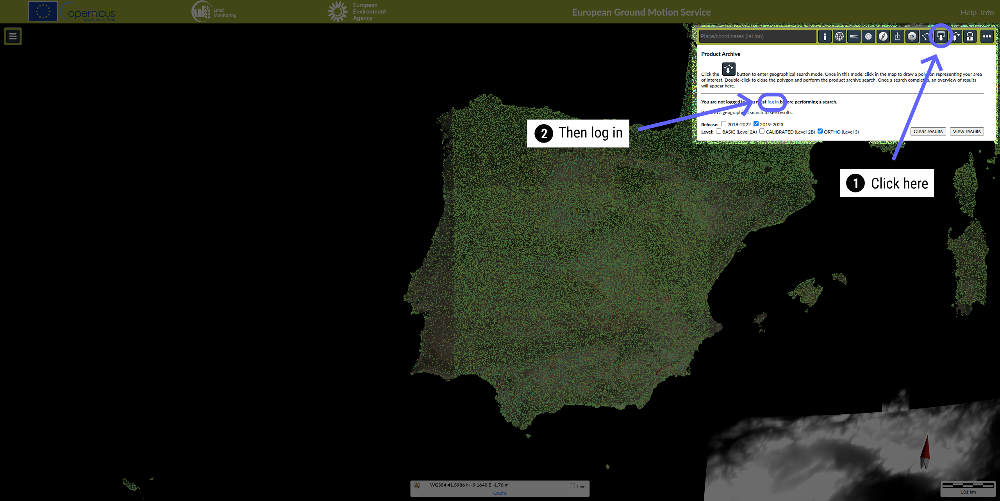
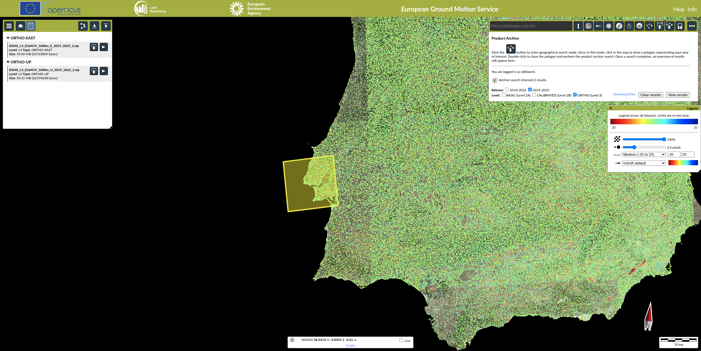
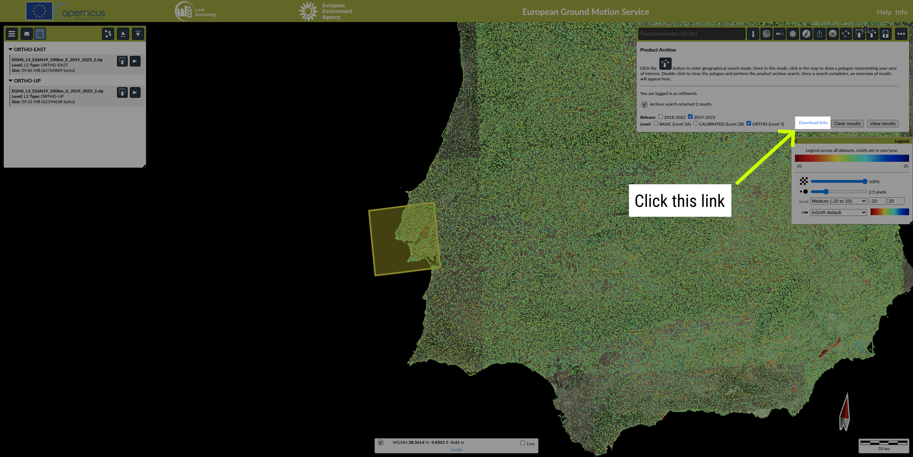

EGMS toolkit
############

**EGMS toolkit** is a set of python scripts to download and manage the InSAR data from `European Ground Motion Service <https://egms.land.copernicus.eu>`_. The toolkit allows:

* to download the data automatically; 
* to merge the files; 
* to clip/crop the datasets.  

**UNDER DEVELOPMENT**

**Release info**: Version 0.2.15 Beta, Apr., 2025

The online documentation can be found `here <https://alexisinsar.github.io/EGMStoolkit/>`_.

Dependencies and installation 
=============================

The requirements are:

* Python 3
* GDAL (best with >= 3.8.0)
* GMT (with GSHHG)

.. note:: 

    GDAL 3.8.0 (or higher) is required for data gridding. 

To install the **EGMS toolkit**, 

On Linux and MacOS: 

.. code-block:: bash

    git clone https://github.com/alexisInSAR/EGMStoolkit.git
    pip3 install -e EGMStoolkit

On Windows: 

.. code-block:: bash

    git clone https://github.com/alexisInSAR/EGMStoolkit.git
    py -m pip3 install -e EGMStoolkit

.. note::

    For an installation in protected directories, the path of the Sentinel-Burst-ID map could be modified.

Run the toolkit
===============

There are two ways to use the toolkit (in shell or in Python). 

**To use the EGMS toolkit, you need a temporary token from the EGMS website. Follow these steps:**

1. Go to the `EGMS website <https://egms.land.copernicus.eu/>`_.
2. Log in with your account;

3. You will be redirected to EU Login page, make sure to provide your credentials and click on "Sign in";

.. image:: private/sign_in_page_step.png
    :width: 750px
    :alt: EU Login

4. After logging in, you will be redirected to the EGMS website, click on the "Geographic archive search" button and draw a small bounding box on the map to select the area of interest. Double click to confirm the selection, make sure to not select a large area.;

5. After selecting the area, click on "Download links";

6. A ``.txt`` file will be downloaded, open it you should see something like this::

.. code-block:: text

    https://egms.land.copernicus.eu/insar-api/archive/download/EGMS_L3_E26N19_100km_E_2019_2023_2.zip?id=fce0bde58db242f2a0d8e59e06728ffe
    https://egms.land.copernicus.eu/insar-api/archive/download/EGMS_L3_E26N19_100km_U_2019_2023_2.zip?id=fce0bde58db242f2a0d8e59e06728ffe

7. The token is the string of characters after ``id=``. In the example above, the token is ``fce0bde58db242f2a0d8e59e06728ffe``. Copy this token and use it with the toolkit.

.. note:: This token is temporary and may expire. If you encounter issues, repeat these steps to obtain a new token.

**Please find an example of the script use in your shell terminal.**

.. code-block:: bash

    EGMStoolkit -l L2a,L2b -r 2018_2022 -t XXXXXXXXXXXXXXXXXXXX -b -6.427059639290446,53.2606655698541,-6.0952332730202095,53.41811986118854 -o ./Output_directory --track 1 --pass Ascending --nomerging -noclipping --quiet --clean

.. note:: 

    The -h option is useful to get a help, i.e., 
    
    .. code-block:: bash
        
        EGMStoolkit -h 

    The --docs option is useful to get the documentation of EGMS-toolkit: i.e., 

    .. code-block:: bash
        
        EGMStoolkit --docs     

**In addition, EGMStoolkit can be used in a Python environment: see the example in the EGMStoolkit documentation.**

Merging the L2 datasets
=======================

Due to the Sentinel-1 acquisition mode, EGMStoolkit offers two different methods of merging: 

* Without reducing duplicate of measurement points in burst/swath overlaps; 
* With reducing duplicate of measurement points in burst/swath overlaps based on the convace-hull algorithm.

The method can be selected by modifing (True or False) the option *__removeduplicate__*. The *__length_threshold__* can be used for the same function (1000 by default). 

The VRT format can be used for the merging and interpolation steps. 

Authors
=======

Alexis Hrysiewicz University College Dublin / iCRAG

Change log
==========

See the **Change log** section of the documentation. 

License
=======

EGMS-toolkit  Copyright (C) 2025  Alexis Hrysiewicz

This program comes with ABSOLUTELY NO WARRANTY. This is free software, and you are welcome to redistribute it under certain conditions (see License). 

Reference
=========

Hrysiewicz, A., Khoshlahjeh Azar, M., & Holohan, E. P. (2024). EGMS-toolkit: a set of Python scripts for improved access to datasets from the European Ground Motion Service. Earth Science Informatics. https://doi.org/10.1007/s12145-024-01356-w 

Funding
=======

The author acknowledges funding from an ESA Living Planet Fellowship (Project name: *Raised Peatland Ecohydrology Evaluation through Sentinel-1 InSAR data and Machine Learning*) and iCRAG, the Science Foundation Ireland Research Centre in Applied Geosciences.  

.. list-table::
   :widths: 75 75 75 
   :header-rows: 0

   * - .. image:: https://brand.esa.int/files/2020/05/ESA_logo_2020_Deep-1024x643.jpg
            :height: 100px
            :alt: ESA Logo
            :target: https://eo4society.esa.int/lpf/alexis-hrysiewicz/
     - .. image:: https://www.icrag-centre.org/t4media/iCRAG_RI_stacked-new_digital-01%20(2)(1).png
            :height: 100px
            :alt: iCRAG logo
            :target: https://www.icrag-centre.org
     - .. image:: https://www.ucd.ie/t4media/crest-ucd.svg
            :height: 75px
            :alt: UCD Logo
            :target: https://www.ucd.ie/

*The Python package reflects only the Author's view and not the one of the ESA. The Agency is not responsible for any use that may be made of the information it contains.*